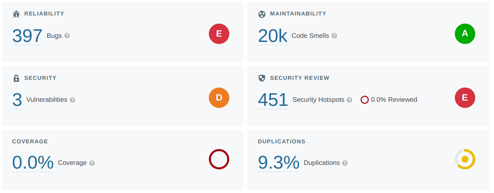
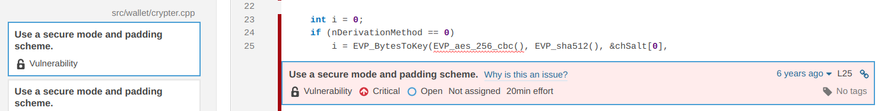
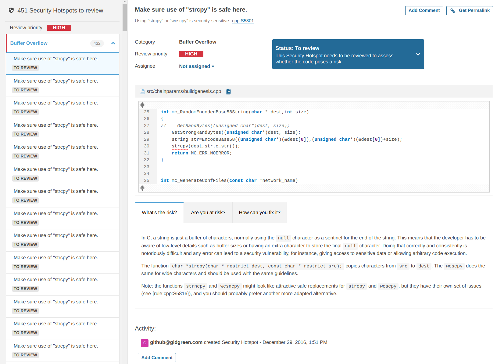
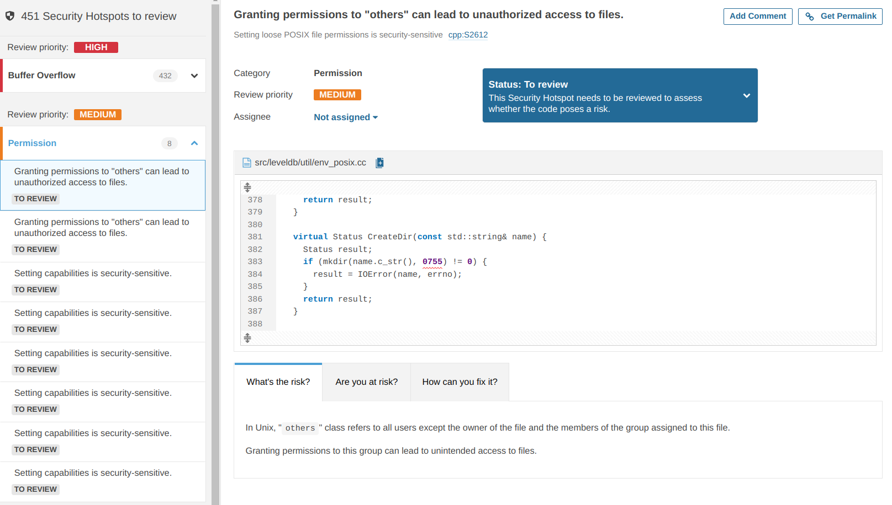
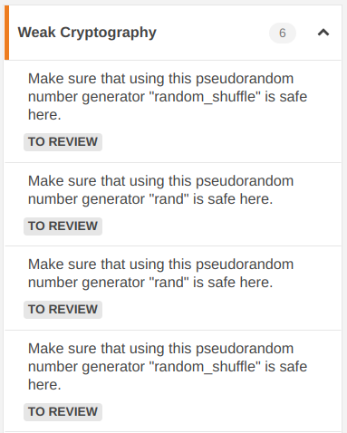

# Security

## 1. SonarCloud - Static Code Analysis

A [SonarCloud](https://sonarcloud.io/) analysis has been run against a fork of the [MultiChain](https://github.com/MultiChain/multichain) repo inside a [Github Action](/.github/workflows/main.yml).

### 1.1. Vulnerabilities

The scan identified 1 vulnerability occuring 3 times in [src/wallet/crypter.cpp](/src/wallet/crypter.cpp), [RSPEC-5542](https://rules.sonarsource.com/c/RSPEC-5542)

### 1.2. Security Hotspots

The security review identified 451 security hotspots:

#### "High" in the "Buffer Overflow" category:

* [cpp:S5801](https://sonarcloud.io/organizations/cetic/rules?open=cpp%3AS5801&rule_key=cpp%3AS5801): Using "strcpy" or "wcscpy" is security-sensitive
* [cpp:S5816](https://sonarcloud.io/organizations/cetic/rules?open=cpp%3AS5816&rule_key=cpp%3AS5816): Using "strncpy" or "wcsncpy" is security-sensitive
* [cpp:S6069](https://sonarcloud.io/organizations/cetic/rules?open=cpp%3AS6069&rule_key=cpp%3AS6069): "sprintf" should not be used
* [cpp:S5813](https://sonarcloud.io/organizations/cetic/rules?open=cpp%3AS5813&rule_key=cpp%3AS5813): Using "strlen" or "wcslen" is security-sensitive

#### "Medium" - Permissions:

#### "Medium" - Weak Cryptography:

Full results are available at https://sonarcloud.io/project/configuration?id=cetic_multichain&analysisMode=GitHubActions 
